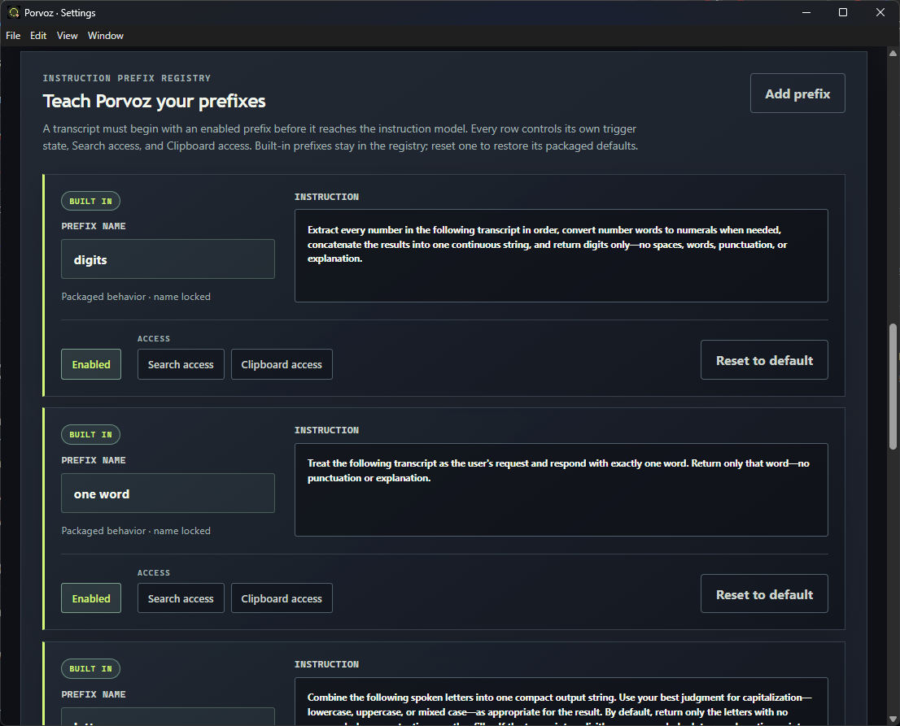

# Porvoz

Porvoz is a tray-first Electron desktop app for voice transcription and customizable instruction workflows. It records microphone audio, sends it to a configured OpenAI-compatible endpoint, and can type the resulting transcription or instruction response into the application that currently owns the cursor.

The API key stays in the operating system credential store. Porvoz does not start a web server or modify the system clipboard when it types a response.

## Download and install

The current release is [Porvoz v1.0.0](https://github.com/bgaeddert/porvoz/releases/tag/v1.0.0). Release packages are x64 builds.

### Windows

Download and run the [Windows installer](https://github.com/bgaeddert/porvoz/releases/download/v1.0.0/Porvoz-1.0.0-win-x64.exe). It is an interactive per-user NSIS installer and can create Start Menu and desktop shortcuts.

### Linux

Download the [Linux AppImage](https://github.com/bgaeddert/porvoz/releases/download/v1.0.0/Porvoz-1.0.0-linux-x86_64.AppImage), then make it executable and launch it:

```bash
chmod +x Porvoz-1.0.0-linux-x86_64.AppImage
./Porvoz-1.0.0-linux-x86_64.AppImage
```

The Linux build requires an X11 desktop session for global hotkeys and typing into the active application. Wayland sessions are not currently supported for those desktop-integration features. A Secret Service provider such as GNOME Keyring/libsecret must be available to save the API key securely. On Ubuntu/Debian, install missing runtime services and libraries with:

```bash
sudo apt install gnome-keyring libsecret-1-0 libgtk-3-0 libnss3 libgbm1 libasound2 libxss1 libxtst6
```

The AppImage does not need to be installed system-wide. The SHA-256 values for both release files are available in [`SHA256SUMS.txt`](https://github.com/bgaeddert/porvoz/releases/download/v1.0.0/SHA256SUMS.txt).

There is no macOS package in the current release.

## First-time setup

Porvoz starts hidden and adds a tray icon. Choose **Open Porvoz** from the tray menu to open Settings; the app continues running in the tray when its windows are closed.

1. Open **Settings**.
2. Enter the endpoint's base URL and API key.
3. Select **Load models**. Porvoz reads the endpoint's `/v1/models` catalog.
4. Select one loaded model for transcription and one for instruction requests.

The endpoint must provide the OpenAI-compatible audio transcription and Responses API operations used by the app. **Verify certificate** is enabled by default for every API request. Disable it only for a trusted self-signed endpoint on a network you control.

## Instruction prefixes

Prefixes are reusable voice triggers. A transcript reaches the instruction model only when it begins with an enabled prefix; matching is case-insensitive. Porvoz can recognize a chain of consecutive prefixes from left to right, remove the matched trigger phrases, and apply every matched instruction in order. If no enabled prefix matches, the transcription is returned without calling the instruction model.



The **Instruction prefix registry** in Settings shows whether each entry is built in or custom, its trigger name, instruction, enabled state, and optional Search or Clipboard access.

### Built-in prefixes

Porvoz includes these five prefixes by default:

- **digits** — Extracts every number from the transcript, converts number words to numerals when needed, concatenates the results, and returns digits only.
- **one word** — Responds with exactly one word, without punctuation or explanation.
- **letters** — Combines spoken letters into a compact string. It can also insert a space, dash, dot, or exclamation point when that is spoken explicitly.
- **search** — Uses web search to find and verify an answer, then responds concisely. It is disabled by default and has Search access preconfigured.
- **clipboard** — Applies the spoken request to the current text clipboard as reference context. It is disabled by default and has Clipboard access preconfigured; clipboard contents are treated as untrusted data and are not replaced.

The **digits**, **one word**, and **letters** prefixes start enabled. **Search** and **clipboard** start disabled so they cannot access those capabilities until you opt in. Built-in names are locked, but their instructions and access settings can be changed. **Reset to default** restores one built-in prefix to its packaged behavior. **Reset to defaults** restores the entire registry.

### Add your own prefix

Select **Add prefix** in the registry and choose one of two paths:

- **Add a prefix manually** creates a blank custom row. Enter a unique trigger name and the instruction the model should follow. New custom prefixes start enabled with Search and Clipboard access off. Changes save as you make them; custom names and instructions remain editable.
- **Create a new prefix with your voice** lets you describe the trigger and desired result aloud. Select **Start listening**, speak the request, then select **Stop and create**. Porvoz sends the recording to the configured transcription and instruction models to draft a name and instruction using your prompt and existing registry. Review and edit the proposed prefix, then select **Add prefix** to save it; nothing is saved until you approve the preview.

Prefix names must be unique, ignoring case. You can enable or disable any prefix and independently grant Search or Clipboard access from its row. Use **Remove prefix** to delete a custom prefix.

## Using Porvoz

Hold **Right Ctrl** anywhere to record by default. Release the key to transcribe and type the result into the application that owns the cursor. Use **Capture hotkey** in Settings to choose another key or combination, such as **Ctrl + Shift + F12**; changes take effect immediately.

The main window also provides **Start recording**, which displays the raw transcription and any instruction response directly in the app. If a transcript begins with an enabled instruction prefix, Porvoz sends it with the editable instruction prompt and prefix registry to the selected instruction model. Transcripts without an enabled prefix bypass the instruction model.

When Search access is granted to a matched prefix, Porvoz enables the hosted `web_search` tool and appends discovered sources to the result. **Logs** stores the 200 most recent transcript and instruction entries on this device.

When a typed response needs a line break, the instruction model can return the exact token `[enter]`; Porvoz converts it into a real Enter key press. macOS requires Accessibility permission. Linux typing uses X11 native keyboard automation.

## Local data and security

Non-secret settings are stored in the platform user-data directory as `settings.json`. The API key is encrypted in a separate credential file using the operating system's secure credential facility. The packaged `electron/defaults.json` contains only first-run defaults and never contains an API key.

Use **Reset to defaults** in Settings to remove the saved API key and editable settings, then rebuild from the packaged defaults.

## Development

Requirements: Node.js 22.14.0 or a compatible Node.js 22 release. From the project directory:

```bash
npm install
npm test
npm start
```

To build locally, run the target command on its native operating system:

```bash
npm run package:win    # Windows x64 NSIS installer
npm run package:linux  # Linux x64 AppImage
```

Linux development and packaging also require native build headers and Electron runtime libraries. On Ubuntu/Debian:

```bash
sudo apt install build-essential libasound2-dev libgbm-dev libgtk-3-dev libnss3-dev \
  libx11-dev libxext-dev libxi-dev libxinerama-dev libxkbcommon-dev \
  libxkbcommon-x11-dev libxrandr-dev libxt-dev libxtst-dev
```

GitHub Actions runs the test suite on Windows and Ubuntu. Pushing a tag beginning with `v` builds the Windows NSIS installer and Linux AppImage, then attaches both files and a checksum manifest to a GitHub Release.

The capture feedback sounds are the CC0 **Recording Start.mp3** and **Recording Stop.mp3** clips by [AbdrTar on Freesound](https://freesound.org/people/AbdrTar/). The start clip is [sound 519985](https://freesound.org/people/AbdrTar/sounds/519985/), and the stop clip is [sound 519986](https://freesound.org/people/AbdrTar/sounds/519986/). Their shared playback volume defaults to 30% and can be adjusted under **Settings → Desktop capture → Recording cues**.
